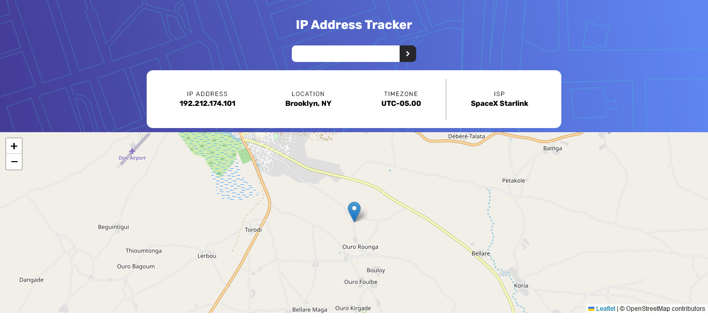

# Frontend Mentor - IP address tracker solution

This is a solution to the [IP address tracker challenge on Frontend Mentor](https://www.frontendmentor.io/challenges/ip-address-tracker-I8-0yYAH0). Frontend Mentor challenges help you improve your coding skills by building realistic projects.

## Table of contents

- [Overview](#overview)
  - [The challenge](#the-challenge)
  - [Screenshot](#screenshot)
  - [Links](#links)
- [My process](#my-process)
  - [Built with](#built-with)
- [Author](#author)
  **Note: Delete this note and update the table of contents based on what sections you keep.**

## Overview

### The challenge

Users should be able to:

- View the optimal layout for each page depending on their device's screen size
- See hover states for all interactive elements on the page
- See their own IP address on the map on the initial page load
- Search for any IP addresses or domains and see the key information and location

### Screenshot

### Links

- Solution URL: [link](https://www.frontendmentor.io/solutions/ip-address-traker-VhzTyywR9a)
- Live Site URL: [link](https://ip-tracker-react-kappa.vercel.app/)

## My process

### Built with

- [React](https://reactjs.org/) - JS library
- CSS custom properties
- Tailwind CSS
- CSS Flexbox
- Mobile-first workflow

## Author

- Website - [Tanmoy Sarkar Pranto](https://my-portfolio-six-delta-12.vercel.app/)
- Frontend Mentor - [@Tanmoy-Sarkar-Pranto](https://www.frontendmentor.io/profile/Tanmoy-Sarkar-Pranto)
